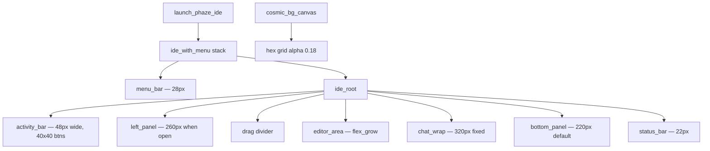

# Design Document: PhazeAI IDE UI Layout Overhaul

## Overview

This document describes the targeted changes needed to fix layout and glassmorphism defects in the Floem-based PhazeAI IDE. All changes are surgical edits to `crates/phazeai-ui/src/app.rs` and `crates/phazeai-ui/src/theme.rs`. No new abstractions, no new files, no framework changes.

The core problems are:
- A `padding(16.0)` on the `ide_with_menu` stack creates a floating-box appearance
- The left panel opens at 300px from the activity bar click handler but 260px everywhere else
- The chat panel has no fixed width, so it stretches with the window
- The bottom panel has no default height, so it collapses to near-zero when first opened
- The cosmic canvas hex grid is too faint (alpha 0.09 instead of 0.18)
- Several panel glow box-shadows use blur < 16px

---

## Architecture

The IDE layout is a single Floem reactive tree rooted at `launch_phaze_ide()`. The relevant call chain is:

```
launch_phaze_ide()
  └── ide_with_menu (stack)          ← padding(16.0) lives here — REMOVE
        ├── menu_bar()               ← height(24.0) → change to 28.0
        └── ide_root()
              ├── activity_bar()     ← 48px wide, buttons 42x42 → change to 40x40
              ├── left_panel()       ← width driven by left_panel_width signal
              ├── [drag divider]
              ├── editor_area
              ├── chat_wrap          ← no fixed width → add width(320.0)
              ├── bottom_panel()     ← no default height → add height(220.0)
              └── status_bar()      ← height(24.0) → change to 22.0
```

All layout values are applied via Floem's `.style(|s| ...)` closures. Reactive signals (`RwSignal<f64>`, `RwSignal<bool>`) drive visibility and sizing. No layout engine changes are needed — only the style values change.



---

## Components and Interfaces

### 1. `ide_with_menu` stack — `launch_phaze_ide()` ~line 6022

Current:
```rust
.style(|s| s.flex_col().width_full().height_full().padding(16.0))
```
Change to:
```rust
.style(|s| s.flex_col().width_full().height_full())
```

No interface change. The `cosmic_bg_canvas` is a sibling in the outer stack and is already `absolute()`, so removing the padding does not affect it.

### 2. Activity bar button click handler — `activity_bar_btn()` ~line 2149

Current:
```rust
state.left_panel_width.set(300.0); // Slightly wider sidebar for premium feel
```
Change to:
```rust
state.left_panel_width.set(260.0);
```

The `left_panel_width` signal is a `RwSignal<f64>` on `IdeState`. The `left_panel()` style closure reads this signal reactively, so the change takes effect immediately on the next frame.

### 3. Activity bar button size — `activity_bar_btn()` ~line 2130

Current:
```rust
s.width(42.0).height(42.0) ... .margin_bottom(6.0)
```
Change to:
```rust
s.width(40.0).height(40.0) ... .margin_bottom(4.0)
```

### 4. Chat panel fixed width — `ide_root()` ~line 5460

Current:
```rust
let chat_wrap = container(chat).style(move |s| {
    ...
    s.height_full()
     .background(p.glass_bg)
     ...
```
Change: add `.width(320.0)` to the style chain. The `apply_if(!state.show_right_panel.get(), ...)` display-none toggle remains unchanged.

### 5. Bottom panel default height — `ide_root()` ~line 5603

Current:
```rust
let bottom = container(bottom_raw).style(move |s| {
    let s = s.apply_if(zen.get(), |s| s.display(floem::style::Display::None));
    if bottom_panel_max.get() {
        s.flex_grow(10.0).min_height(0.0)
    } else {
        s
    }
});
```
Change the `else` branch to add a default height:
```rust
    } else {
        s.height(220.0)
    }
```
The `show_bottom_panel` signal already controls visibility via `display(None)` in `bottom_panel()` itself. The `height(220.0)` only applies when the panel is visible and not maximized.

### 6. Left panel glow — `left_panel()` ~line 2481

Current `box_shadow_blur(12.0)`. Change to `box_shadow_blur(16.0)`.

### 7. Chat panel glow — `chat_wrap` style ~line 5460

Current `box_shadow_blur(12.0)`. Change to `box_shadow_blur(16.0)`.

### 8. Menu bar height — `menu_bar()` ~line 5950

Current `s.height(24.0).min_height(24.0)`. Change to `s.height(28.0).min_height(28.0)`.

### 9. Status bar height — `status_bar()` ~line 2941

Current `s.height(24.0)`. Change to `s.height(22.0)`.

### 10. Cosmic canvas hex grid opacity — `cosmic_bg_canvas()` ~line 2078

Current:
```rust
let grid_color = p.accent.with_alpha(0.09);
```
Change to:
```rust
let grid_color = p.accent.with_alpha(0.18);
```

---

## Data Models

No new data models. The existing `IdeState` signals are sufficient:

| Signal | Type | Role |
|---|---|---|
| `left_panel_width` | `RwSignal<f64>` | Drives left panel width reactively |
| `show_left_panel` | `RwSignal<bool>` | Drives left panel visibility |
| `show_right_panel` | `RwSignal<bool>` | Drives chat panel visibility |
| `bottom_panel_maximized` | `RwSignal<bool>` | Switches bottom panel between 220px and flex_grow |
| `zen_mode` | `RwSignal<bool>` | Hides activity bar, left panel, bottom panel, status bar |

The `PhazePalette` struct in `theme.rs` already has `glass_bg`, `glass_border`, and `glow` fields. No schema changes needed.

The `constants.rs` file has `STATUS_BAR_HEIGHT`, `MENU_BAR_HEIGHT`, and `DEFAULT_CHAT_WIDTH` constants. These should be updated to match the new values to keep them in sync:

```rust
pub const STATUS_BAR_HEIGHT: f32 = 22.0;   // was 24.0
pub const MENU_BAR_HEIGHT: f32 = 28.0;     // was 24.0
pub const DEFAULT_CHAT_WIDTH: f32 = 320.0; // already correct
```

---

## Correctness Properties

*A property is a characteristic or behavior that should hold true across all valid executions of a system — essentially, a formal statement about what the system should do. Properties serve as the bridge between human-readable specifications and machine-verifiable correctness guarantees.*

### Property 1: Left panel open width is always 260px

*For any* activity bar tab, when the left panel is opened (via any code path that sets `show_left_panel = true`), the `left_panel_width` signal value SHALL equal 260.0.

**Validates: Requirements 2.1, 2.2, 2.3**

### Property 2: Cosmic theme glass_bg alpha is within bounds

*For any* theme variant where `is_cosmic()` returns true, the alpha component of `glass_bg` SHALL be no greater than 180 (out of 255).

**Validates: Requirements 5.5**

### Property 3: Non-cosmic theme glass_bg is opaque

*For any* theme variant where `is_cosmic()` returns false, the alpha component of `glass_bg` SHALL be greater than 200 (out of 255), indicating near-full opacity.

**Validates: Requirements 5.6**

### Property 4: Zen mode hides all peripheral panels

*For any* IDE state where `zen_mode` is true, the activity bar, left panel, bottom panel, and status bar SHALL all have `display(None)` applied to their container wrappers.

**Validates: Requirements 9.3**

---

## Error Handling

These are style-only changes with no new failure modes. The relevant considerations:

- **Signal reads in style closures**: Floem style closures are reactive — if a signal read panics (e.g., signal dropped), the entire view panics. No new signals are introduced, so no new risk.
- **Width/height of 0**: When panels are hidden via `display(None)`, Floem removes them from layout entirely. The `width(0.0)` path in `left_panel()` is a belt-and-suspenders guard that already exists and is not changed.
- **Bottom panel height with no content**: Setting `height(220.0)` on the container when the panel is visible but empty (e.g., no terminal spawned yet) is safe — Floem will render an empty box at that height.
- **Constants drift**: `crates/phazeai-core/src/constants.rs` has `STATUS_BAR_HEIGHT` and `MENU_BAR_HEIGHT`. These are informational constants used in tests and documentation. They must be updated alongside the style changes to prevent test drift.

---

## Testing Strategy

### Dual approach

Unit tests verify specific style values and state transitions. Property-based tests verify universal invariants across all theme variants and signal states.

**Unit tests** (specific examples and edge cases):
- Verify `ide_with_menu` style has no padding
- Verify `menu_bar` style has `height(28.0)`
- Verify `status_bar` style has `height(22.0)`
- Verify `activity_bar_btn` style has `width(40.0)` and `height(40.0)`
- Verify `chat_wrap` style has `width(320.0)`
- Verify `bottom_panel` container style has `height(220.0)` when not maximized
- Verify `bottom_panel` container style has `flex_grow(10.0)` when maximized
- Verify `left_panel` box_shadow_blur is >= 16.0
- Verify `chat_wrap` box_shadow_blur is >= 16.0
- Verify `cosmic_bg_canvas` hex grid uses alpha >= 0.18
- Verify `is_cosmic()` returns true for MidnightBlue, Cyberpunk, Synthwave84, Andromeda
- Verify `is_cosmic()` returns false for Dark, Light, Dracula, TokyoNight, etc.

**Property-based tests** (universal invariants):

Use the `proptest` crate (already in the Rust ecosystem, no new dependencies needed for pure logic tests).

Each property test must run a minimum of 100 iterations.

Tag format: `// Feature: phazeai-ui-layout-overhaul, Property {N}: {property_text}`

**Property 1 test**: Generate a random `Tab` variant, simulate the `on_click_stop` handler logic, assert `left_panel_width == 260.0`.
```
// Feature: phazeai-ui-layout-overhaul, Property 1: left panel open width is always 260px
```

**Property 2 test**: Iterate over all `ThemeVariant` values where `is_cosmic()` is true, check `palette.glass_bg` alpha <= 180.
```
// Feature: phazeai-ui-layout-overhaul, Property 2: cosmic theme glass_bg alpha <= 180
```

**Property 3 test**: Iterate over all `ThemeVariant` values where `is_cosmic()` is false, check `palette.glass_bg` alpha > 200.
```
// Feature: phazeai-ui-layout-overhaul, Property 3: non-cosmic theme glass_bg is opaque
```

**Property 4 test**: Generate random boolean combinations of panel visibility signals, set `zen_mode = true`, assert all peripheral panel wrappers have `display(None)`.
```
// Feature: phazeai-ui-layout-overhaul, Property 4: zen mode hides all peripheral panels
```

Unit tests should live in `crates/phazeai-ui/tests/` or as `#[cfg(test)]` modules in `app.rs`. Property tests for theme palette values can live in `crates/phazeai-ui/src/theme.rs` as `#[cfg(test)]` since they only need the `PhazePalette` and `PhazeTheme` types.
